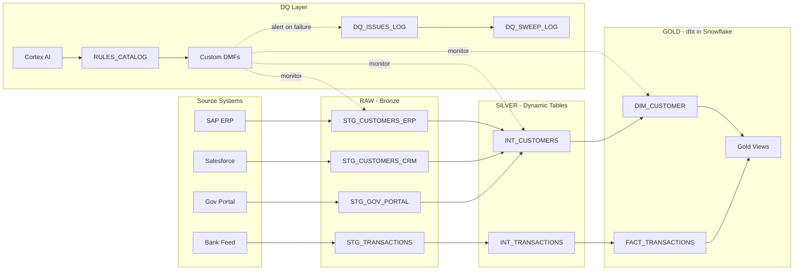

# Data Quality Monitoring with Snowflake

| | |
|---|---|
| **Platform** | Snowflake Enterprise Edition |
| **Features** | Data Metric Functions, Dynamic Tables, Cortex AI, dbt in Snowflake |
| **Modules** | 15 hands-on modules |
| **Duration** | 4-10 hours (track-dependent) |
| **License** | Apache 2.0 |

Build a **production-ready data quality monitoring framework** using only native Snowflake capabilities. No external tools, no additional infrastructure, no ongoing maintenance -- just Snowflake.

---

## Your Facilitator

| | |
|---|---|
| **Name** | Marawen Charni |
| **Role** | Senior Partner Solutions Engineer, Snowflake |
| **Region** | Middle East & Africa |
| **Focus** | Data Cloud, Partner Enablement, AI/ML, Data Engineering |
| **Events** | Speaker at GITEX, LEAP |

---

## The Scenario: A Saudi Holding Company

> **Fictional context for this lab.** All data, names, and scenarios are synthetic.

Our fictional company is a Saudi diversified holding group headquartered in Riyadh with subsidiaries in real estate development, facility management, and industrial services. They operate across 5 regions of KSA with 56 corporate customers and process ~50 financial transactions daily.

### The Business Problem

The company recently migrated to Snowflake as their enterprise data platform. Data flows in from four source systems:

| Source | System | What It Contains |
|--------|--------|-----------------|
| **ERP** | SAP S/4HANA | 30 corporate customer records (Arabic names, National IDs, IBANs) |
| **CRM** | Salesforce | 25 customer records (overlapping with ERP -- different field formats) |
| **Gov Portal** | Unified National Platform (Nafath) | 10 government-verified identity records |
| **Bank Feed** | SAMA-regulated payment gateway | 50 daily transactions (SAR amounts, beneficiary refs) |

**The challenge:** Each source system has different data quality characteristics. The ERP has customers with invalid National IDs (too short, wrong format). The CRM has NULL identifiers. Customer "Abdullah" appears in both ERP and CRM with slightly different details. Transaction feeds occasionally go stale. And nobody knows which records to trust when sources disagree.

**Your mission:** Build a comprehensive, automated data quality monitoring framework that detects issues at every layer (RAW → Silver → Gold), logs them, alerts stakeholders, and provides an executive dashboard -- all using native Snowflake capabilities.

### The Data Landscape

```
CORP_DWH (Corporate Data Warehouse)
├── RAW     → 4 staging tables (raw feeds, untransformed)
├── SILVER  → 2 Dynamic Tables (deduped, merged, auto-refreshing)
├── GOLD    → 2 dimension/fact tables + views (dbt-governed, tested)
└── DQ      → Rules catalog, DMFs, issues log, sweep log, AI models
```

### Why This Matters

1. **Regulatory compliance** -- Saudi Central Bank (SAMA) requires accurate beneficiary identification; invalid National IDs risk transaction rejection
2. **Customer 360 trust** -- Merging ERP + CRM + Gov data without quality checks produces unreliable golden records
3. **Operational SLAs** -- Transaction feeds must arrive within 2 hours; stale data means missed payment deadlines
4. **Board reporting** -- The CFO needs a single DQ scorecard across all entities, not per-system excuses

---

## What You Will Build

A complete DQ lifecycle from raw data landing to executive dashboard:

- **Data Metric Functions (DMFs)** -- system and custom checks on every layer
- **Dynamic Tables** -- auto-refreshing Silver layer (RAW to Silver)
- **dbt in Snowflake** -- governed Gold layer with tests (Silver to Gold)
- **Rules Catalog** -- self-service rule management with auto-provisioning
- **Expectations** -- automated pass/fail verdicts and cross-reference integrity
- **Cortex AI** -- natural language rule parsing, bulk table analysis, anomaly detection
- **Horizon Governance** -- tags, classification, lineage integration
- **Alerts & Dashboards** -- email notifications, sweep logs, BI-ready views

## Workshop Duration

| Track | Duration | Modules | Best For |
|-------|----------|---------|----------|
| **Half Day** | 4 hours | 0, 0B, 1, 2, 3 | Quick enablement -- core DQ framework |
| **Standard** | 6 hours | + 4, 4B, 5 | Full detection + remediation + AI |
| **Full Day** | 8 hours | All (demo 5+6) | Complete enterprise framework |
| **Extended** | 2 days | All hands-on | Deep-dive with exercises + discussion |

**Detailed timing (all hands-on, no shortcuts):**

| Module | Topic | Duration | Cumulative |
|--------|-------|----------|-----------|
| 0 | Environment Setup | 20 min | 0:20 |
| 0B | Dynamic Tables + dbt in Snowflake | 90 min | 1:50 |
| 1 | Raw Layer DQ (System DMFs) | 45 min | 2:35 |
| 2 | Silver Layer DQ (Custom DMFs) | 60 min | 3:35 |
| 3 | Gold Rules Catalog + Consistency | 60 min | 4:35 |
| 4 | Expectations + Cross-Reference Integrity | 45 min | 5:20 |
| 4B | Record Investigation + Remediation | 45 min | 6:05 |
| 5 | AI/ML-Powered DQ (Cortex AI) | 75 min | 7:20 |
| 6 | Governance (Horizon Integration) | 45 min | 8:05 |
| 7 | Alerts + Scheduled Monitoring | 45 min | 8:50 |
| 1B | DMF Cost Analysis (needs Account Usage lag) | 20 min | 9:10 |
| 8 | Dashboard (choose 1 of 3 variants) | 45 min | 9:55 |
| 9 | Teardown | 5 min | 10:00 |
| | **Total instruction time** | **10 hours** | |
| | + Breaks (3x15 min) + Lunch (45 min) | +1:30 | **11:30** |

## Architecture



## Quick Start

> **Students:** Go directly to **[START_HERE.md](START_HERE.md)** for step-by-step instructions.

Below is a condensed version for experienced users:

### Step 1: Unzip the lab package

```bash
unzip snowflake-data-quality-monitoring-hol.zip
cd snowflake-data-quality-monitoring-hol
```

### Step 2: Install the Snowflake CLI

```bash
brew install snowflake-cli    # macOS
# OR: pip install snowflake-cli  (all platforms)
snow --version                # verify
```

### Step 3: Configure CLI connection

```bash
snow connection add
# Connection name: dq-lab
# Enter: account ID, username, password, role=ACCOUNTADMIN, warehouse=DQ_LAB_WH
snow connection set-default dq-lab
snow connection test           # should show "Connection test successful"
```

### Step 4: Upload notebooks to Snowflake

1. Log into [Snowsight](https://app.snowflake.com)
2. Go to **Workspaces** (left sidebar)
3. Create a folder: **+ > New Folder** > name it `DQ_Lab`
4. Upload all 15 `.ipynb` files from the `notebooks/` folder: **+ > Upload File** (multi-select)

### Step 5: Run Module 0 (Setup)

1. Open `0_SETUP.ipynb` in your workspace
2. Set role to **ACCOUNTADMIN** and warehouse to **DQ_LAB_WH** (top-left picker)
3. Run all cells top to bottom
4. Verify the final cell shows: ERP=30, CRM=25, GOV=10, TXN=50

### Step 6: Continue through modules in order

```
0 -> 0B -> 1 -> 2 -> 3 -> 4 -> 4B -> 5 -> 6 -> 7 -> 1B -> 8A/B/C -> 9
```

Each notebook is self-contained with explanations, code, and verification checkpoints.

> **dbt deploy:** Do NOT deploy upfront. When you reach Module 0B Step 1, the notebook will tell you to open a terminal and run `snow dbt deploy`. The notebook explains what you're deploying and why before you execute it.
>
> **After Module 0:** Switch role to `CORP_DQ_ADMIN` for all remaining modules. You won't need ACCOUNTADMIN again.

> **Detailed prerequisites:** See [guide/PREREQUISITES.md](guide/PREREQUISITES.md) for trial account signup, troubleshooting, and more.
>
> **Reference while working:** See [guide/STUDENT_GUIDE.md](guide/STUDENT_GUIDE.md) for DQ domains, SQL patterns, glossary, and expected outputs per module.

## What Makes This Workshop Unique

| Feature | This Workshop | Typical DQ Workshops |
|---------|--------------|---------------------|
| Tools required | Snowflake only | Great Expectations + Airflow + dbt Cloud + ... |
| Infrastructure | Zero (serverless DMFs) | Kubernetes, schedulers, external DBs |
| AI-powered | Cortex AI for rule discovery | Manual rule writing only |
| Governance | Native Horizon integration | Separate catalog tool |
| Cost visibility | Built-in (Module 1B) | Rarely addressed |
| Remediation workflow | Full lifecycle (detect -> log -> quarantine -> resolve) | Usually just detection |
| Real dbt | Deployed in Snowflake (`EXECUTE DBT PROJECT`) | External dbt CLI |

> **Note on dbt:** This lab provides a pre-built dbt project (`dbt/corp_dq_gold/`) ready to deploy. It does NOT teach dbt model development (writing SQL models, schema.yml, etc.). The focus is on how dbt integrates with Snowflake's native DQ framework -- deploying as a Snowflake object, running via SQL, and comparing dbt tests with DMFs. **Want to learn how the project was built?** See [guide/APPENDIX_DBT_DEVELOPMENT.md](guide/APPENDIX_DBT_DEVELOPMENT.md).

## Who Is This For

- **SI Partners** implementing DQ for enterprise customers
- **Data Engineers** building quality frameworks on Snowflake
- **Data Stewards** learning self-service rule management
- **Analytics Engineers** combining dbt tests with continuous DMF monitoring

## DQ Domains Covered

| Domain | Question | Lab Example |
|--------|----------|-------------|
| Accuracy | Correct format? | National ID `98765` too short (need 10 digits) |
| Completeness | Fields filled? | 10 CRM records with NULL National ID |
| Uniqueness | Duplicates? | Abdullah in both ERP and CRM |
| Freshness | Up to date? | Transaction 3 days stale (SLA: 2 hours) |
| Validity | Allowed values? | City not in reference list |
| Volume | Enough data? | ERP feed drops from 1000 to 5 rows |
| Consistency | Fields agree? | ERP customer missing mandatory IBAN |

## Repository Structure

```
├── notebooks/                          # 15 Snowflake Notebooks (execute in Workspaces)
│   ├── 0_SETUP.ipynb                   #   Environment + sample data (30+25+10+50 rows)
│   ├── 0B_DATA_PIPELINE.ipynb          #   Dynamic Tables + dbt in Snowflake
│   ├── 1_RAW_LAYER_DQ.ipynb            #   System DMFs (ROW_COUNT, NULL_COUNT, FRESHNESS)
│   ├── 1B_DMF_COSTS.ipynb              #   Cost visibility + optimization
│   ├── 2_SILVER_LAYER_DQ.ipynb         #   Custom DMFs (National ID, IBAN, phone, dupes)
│   ├── 3_GOLD_LAYER_DQ.ipynb           #   Rules Catalog + auto-provisioning
│   ├── 4_EXPECTATIONS.ipynb            #   Expectations + cross-reference integrity
│   ├── 4B_REMEDIATION.ipynb            #   Record investigation + issue logging
│   ├── 5_AI_ML_DQ.ipynb                #   Cortex AI rule suggestions + anomaly detection
│   ├── 6_GOVERNANCE.ipynb              #   Tags, classification, Horizon integration
│   ├── 7_ALERTS.ipynb                  #   Email alerts + scheduled DQ sweep
│   ├── 8A_DASHBOARD_NATIVE.ipynb       #   Dashboard (SQL-only, native charts)
│   ├── 8B_DASHBOARD_PYTHON.ipynb       #   Dashboard (Python + plotly)
│   ├── 8C_DASHBOARD_STREAMLIT.ipynb    #   Dashboard (Streamlit in Notebook)
│   ├── 9_TEARDOWN.ipynb                #   Cleanup all objects
│   └── streamlit_dq_app.py             #   Standalone Streamlit dashboard (used by Module 8C)
│
├── dbt/corp_dq_gold/                   # dbt project (deploy with snow dbt deploy)
│   ├── dbt_project.yml
│   ├── profiles.yml
│   └── models/
│       ├── schema.yml                  #   Sources, tests, docs
│       ├── staging/                    #   stg_silver_customers, stg_silver_transactions
│       └── marts/                      #   dim_customer, fact_transactions
│
├── START_HERE.md                          # Student entry point (start here!)
├── guide/                              # Student-facing documentation
│   ├── STUDENT_GUIDE.md                #   Full reference: domains, patterns, glossary
│   ├── STUDENT_GUIDE.html              #   Same content, rich visual rendering
│   ├── PREREQUISITES.md                #   Trial account, CLI install, workspace setup
│   ├── WORKSHOP_CARDS.md               #   One-page summary per module
│   ├── LAB_MAP.md                      #   Flow diagram + learning paths
│   ├── APPENDIX_DBT_DEVELOPMENT.md     #   How we built the dbt project (tutorial)
│   └── DQ_HOL_Feedback_Form.xlsx       #   Feedback form + cohort tracker (Excel)
│
├── facilitator/                        # Instructor materials
│   └── FACILITATOR_NOTES.md            #   Teaching tips, timing, common issues
│
├── scripts/                            # Utility scripts
│   ├── setup_only.sql                  #   Quick setup without notebook (CLI only)
│   ├── teardown.sql                    #   Quick cleanup without notebook
│   └── validate_notebooks.py           #   Validates all .ipynb are valid JSON
│
├── LICENSE                             # Apache 2.0
└── README.md                           # This file
```

## Contact

For questions, feedback, or issues with this lab, reach out to your workshop facilitator.

## Keywords

`snowflake` `data-quality` `data-metric-functions` `dmf` `dbt` `dynamic-tables` `cortex-ai` `data-governance` `horizon` `hands-on-lab` `workshop` `enterprise` `monitoring` `expectations` `alerts`

## License

Apache 2.0. See [LICENSE](LICENSE).
