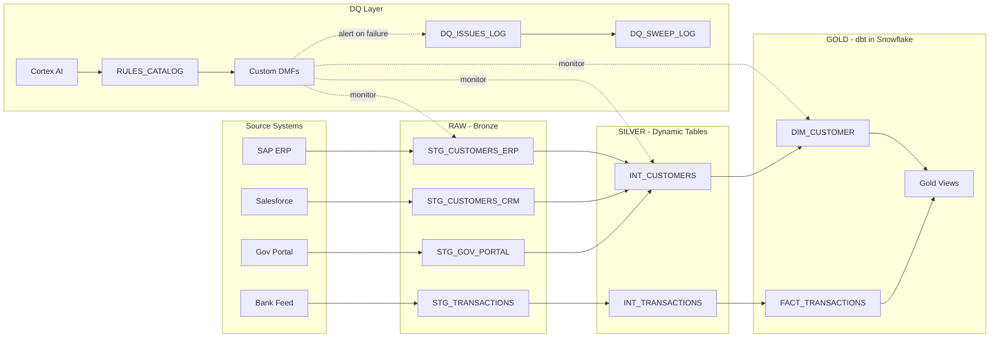

# Data Quality Monitoring with Snowflake


Build a **production-ready data quality monitoring framework** using only native Snowflake capabilities. No external tools, no additional infrastructure, no ongoing maintenance -- just Snowflake.

## What You Will Build

A complete DQ lifecycle from raw data landing to executive dashboard:

- **Data Metric Functions (DMFs)** -- system and custom checks on every layer
- **Dynamic Tables** -- auto-refreshing Silver layer (RAW to Silver)
- **dbt in Snowflake** -- governed Gold layer with tests (Silver to Gold)
- **Rules Catalog** -- self-service rule management with auto-provisioning
- **Expectations** -- automated pass/fail verdicts and cross-reference integrity
- **Cortex AI** -- natural language rule parsing, bulk table analysis, anomaly detection
- **Horizon Governance** -- tags, classification, lineage integration
- **Alerts & Dashboards** -- email notifications, sweep logs, BI-ready views

## Workshop Duration

| Track | Duration | Modules | Best For |
|-------|----------|---------|----------|
| **Half Day** | 4 hours | 0, 0B, 1, 1B, 2, 3 | Quick enablement -- core DQ framework |
| **Standard** | 6 hours | + 4, 4B, 5 | Full detection + remediation + AI |
| **Full Day** | 8 hours | All (demo 5+6) | Complete enterprise framework |
| **Extended** | 2 days | All hands-on | Deep-dive with exercises + discussion |

**Detailed timing (all hands-on, no shortcuts):**

| Module | Topic | Duration | Cumulative |
|--------|-------|----------|-----------|
| 0 | Environment Setup | 20 min | 0:20 |
| 0B | Dynamic Tables + dbt in Snowflake | 90 min | 1:50 |
| 1 | Raw Layer DQ (System DMFs) | 45 min | 2:35 |
| 1B | DMF Cost Management | 20 min | 2:55 |
| 2 | Silver Layer DQ (Custom DMFs) | 60 min | 3:55 |
| 3 | Gold Rules Catalog + Consistency | 60 min | 4:55 |
| 4 | Expectations + Cross-Reference Integrity | 45 min | 5:40 |
| 4B | Record Investigation + Remediation | 45 min | 6:25 |
| 5 | AI/ML-Powered DQ (Cortex AI) | 75 min | 7:40 |
| 6 | Governance (Horizon Integration) | 45 min | 8:25 |
| 7 | Alerts + Scheduled Monitoring | 45 min | 9:10 |
| 8 | Dashboard (choose 1 of 3 variants) | 45 min | 9:55 |
| 9 | Teardown | 5 min | 10:00 |
| | **Total instruction time** | **10 hours** | |
| | + Breaks (3x15 min) + Lunch (45 min) | +1:30 | **11:30** |

## Architecture



## Quick Start (I have an account -- what do I do?)

### Step 1: Clone the repo

```bash
git clone https://github.com/mcharni76/snowflake-data-quality-monitoring-hol.git
cd snowflake-data-quality-monitoring-hol
```

### Step 2: Install the Snowflake CLI

```bash
brew install snowflake-cli    # macOS
# OR: pip install snowflake-cli  (all platforms)
snow --version                # verify
```

### Step 3: Configure CLI connection

```bash
snow connection add
# Enter: account ID, username, password, role=ACCOUNTADMIN, warehouse=COMPUTE_WH
snow connection set-default default
snow connection test           # should show "Connection test successful"
```

### Step 4: Upload notebooks to Snowflake

1. Log into [Snowsight](https://app.snowflake.com)
2. Go to **Workspaces** (left sidebar)
3. Create a folder: **+ > New Folder** > name it `DQ_Lab`
4. Upload all 15 `.ipynb` files from the `notebooks/` folder: **+ > Upload File** (multi-select)

### Step 5: Run Module 0 (Setup)

1. Open `0_SETUP.ipynb` in your workspace
2. Set role to **ACCOUNTADMIN** and warehouse to **COMPUTE_WH** (top-left picker)
3. Run all cells top to bottom
4. Verify the final cell shows: ERP=30, CRM=25, GOV=10, TXN=50

### Step 6: Continue through modules in order

```
0 -> 0B -> 1 -> 1B -> 2 -> 3 -> 4 -> 4B -> 5 -> 6 -> 7 -> 8A/B/C -> 9
```

Each notebook is self-contained with explanations, code, and verification checkpoints.

> **dbt deploy:** Module 0B will instruct you to deploy the dbt project from your terminal when you reach that step. Don't do it upfront -- the notebook explains what you're deploying and why.
>
> **After Module 0:** Switch role to `CORP_DQ_ADMIN` for all remaining modules. You won't need ACCOUNTADMIN again.

> **Detailed prerequisites:** See [guide/PREREQUISITES.md](guide/PREREQUISITES.md) for trial account signup, troubleshooting, and more.
>
> **Reference while working:** See [guide/STUDENT_GUIDE.md](guide/STUDENT_GUIDE.md) for DQ domains, SQL patterns, glossary, and expected outputs per module.

## What Makes This Workshop Unique

| Feature | This Workshop | Typical DQ Workshops |
|---------|--------------|---------------------|
| Tools required | Snowflake only | Great Expectations + Airflow + dbt Cloud + ... |
| Infrastructure | Zero (serverless DMFs) | Kubernetes, schedulers, external DBs |
| AI-powered | Cortex AI for rule discovery | Manual rule writing only |
| Governance | Native Horizon integration | Separate catalog tool |
| Cost visibility | Built-in (Module 1B) | Rarely addressed |
| Remediation workflow | Full lifecycle (detect -> log -> quarantine -> resolve) | Usually just detection |
| Real dbt | Deployed in Snowflake (`EXECUTE DBT PROJECT`) | External dbt CLI |

> **Note on dbt:** This lab provides a pre-built dbt project (`dbt/corp_dq_gold/`) ready to deploy. It does NOT teach dbt model development (writing SQL models, schema.yml, etc.). The focus is on how dbt integrates with Snowflake's native DQ framework -- deploying as a Snowflake object, running via SQL, and comparing dbt tests with DMFs. **Want to learn how the project was built?** See [guide/APPENDIX_DBT_DEVELOPMENT.md](guide/APPENDIX_DBT_DEVELOPMENT.md).

## Who Is This For

- **SI Partners** implementing DQ for enterprise customers
- **Data Engineers** building quality frameworks on Snowflake
- **Data Stewards** learning self-service rule management
- **Analytics Engineers** combining dbt tests with continuous DMF monitoring

## DQ Domains Covered

| Domain | Question | Lab Example |
|--------|----------|-------------|
| Accuracy | Correct format? | National ID `98765` too short (need 10 digits) |
| Completeness | Fields filled? | 10 CRM records with NULL National ID |
| Uniqueness | Duplicates? | Abdullah in both ERP and CRM |
| Freshness | Up to date? | Transaction 3 days stale (SLA: 2 hours) |
| Validity | Allowed values? | City not in reference list |
| Volume | Enough data? | ERP feed drops from 1000 to 5 rows |
| Consistency | Fields agree? | ERP customer missing mandatory IBAN |

## Repository Structure

```
├── notebooks/                          # 15 Snowflake Notebooks (execute in Workspaces)
│   ├── 0_SETUP.ipynb                   #   Environment + sample data (30+25+10+50 rows)
│   ├── 0B_DATA_PIPELINE.ipynb          #   Dynamic Tables + dbt in Snowflake
│   ├── 1_RAW_LAYER_DQ.ipynb            #   System DMFs (ROW_COUNT, NULL_COUNT, FRESHNESS)
│   ├── 1B_DMF_COSTS.ipynb              #   Cost visibility + optimization
│   ├── 2_SILVER_LAYER_DQ.ipynb         #   Custom DMFs (National ID, IBAN, phone, dupes)
│   ├── 3_GOLD_LAYER_DQ.ipynb           #   Rules Catalog + auto-provisioning
│   ├── 4_EXPECTATIONS.ipynb            #   Expectations + cross-reference integrity
│   ├── 4B_REMEDIATION.ipynb            #   Record investigation + issue logging
│   ├── 5_AI_ML_DQ.ipynb                #   Cortex AI rule suggestions + anomaly detection
│   ├── 6_GOVERNANCE.ipynb              #   Tags, classification, Horizon integration
│   ├── 7_ALERTS.ipynb                  #   Email alerts + scheduled DQ sweep
│   ├── 8A_DASHBOARD_NATIVE.ipynb       #   Dashboard (SQL-only, native charts)
│   ├── 8B_DASHBOARD_PYTHON.ipynb       #   Dashboard (Python + plotly)
│   ├── 8C_DASHBOARD_STREAMLIT.ipynb    #   Dashboard (Streamlit in Notebook)
│   ├── 9_TEARDOWN.ipynb                #   Cleanup all objects
│   └── streamlit_dq_app.py             #   Standalone Streamlit app (Module 8C)
│
├── dbt/corp_dq_gold/                   # dbt project (deploy with snow dbt deploy)
│   ├── dbt_project.yml
│   ├── profiles.yml
│   └── models/
│       ├── schema.yml                  #   Sources, tests, docs
│       ├── staging/                    #   stg_silver_customers, stg_silver_transactions
│       └── marts/                      #   dim_customer, fact_transactions
│
├── guide/                              # Student-facing documentation
│   ├── STUDENT_GUIDE.md                #   Full reference: domains, patterns, glossary
│   ├── STUDENT_GUIDE.html              #   Same content, rich visual rendering
│   ├── PREREQUISITES.md                #   Trial account, CLI install, workspace setup
│   ├── WORKSHOP_CARDS.md               #   One-page summary per module
│   ├── LAB_MAP.md                      #   Flow diagram + learning paths
│   └── APPENDIX_DBT_DEVELOPMENT.md     #   How we built the dbt project (tutorial)
│
├── facilitator/                        # Instructor materials
│   └── FACILITATOR_NOTES.md            #   Teaching tips, timing, common issues
│
├── scripts/                            # Utility scripts
│   ├── setup_only.sql                  #   Quick setup without notebook (CLI only)
│   ├── teardown.sql                    #   Quick cleanup without notebook
│   └── validate_notebooks.py           #   Validates all .ipynb are valid JSON
│
├── .github/workflows/validate.yml      # CI: validates notebooks on push
├── .gitignore
├── LICENSE                             # Apache 2.0
├── PUBLISHING.md                       # Release process notes
└── README.md                           # This file
```

## Publishing & Contributing

**Repository:** [github.com/mcharni76/snowflake-data-quality-monitoring-hol](https://github.com/mcharni76/snowflake-data-quality-monitoring-hol)

Contributions welcome. To contribute:
1. Fork the repo
2. Create a feature branch
3. Submit a PR with description of changes

## Keywords

`snowflake` `data-quality` `data-metric-functions` `dmf` `dbt` `dynamic-tables` `cortex-ai` `data-governance` `horizon` `hands-on-lab` `workshop` `enterprise` `monitoring` `expectations` `alerts`

## License

Apache 2.0. See [LICENSE](LICENSE).
