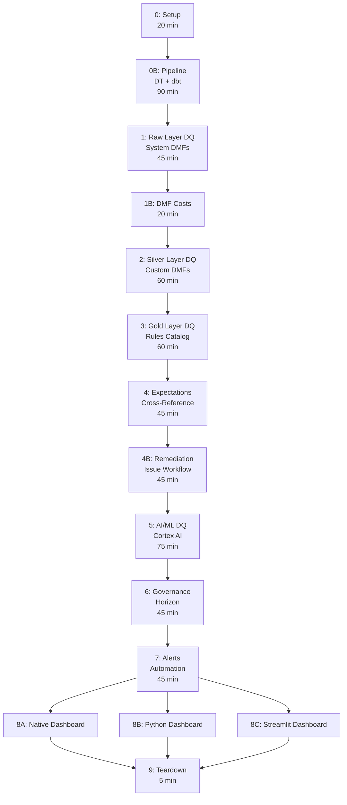

# Lab Map

Visual journey showing module flow, dependencies, and learning paths.

## Module Flow (Mermaid)



## Learning Paths

### Half-Day Path (4 hours)
**Focus:** Core DQ framework -- enough to start monitoring immediately

```
0: Setup -> 0B: Pipeline -> 1: Raw DQ -> 2: Silver DMFs -> 3: Gold Catalog
```

**What students leave with:** A working DQ monitoring framework with system DMFs, custom DMFs, and a Rules Catalog. They can apply this to their own data.

---

### Six-Hour Path (6 hours)
**Focus:** Full detection + remediation loop

```
Half-Day Path + 4: Expectations -> 4B: Remediation -> 5: AI/ML DQ
```

**What students leave with:** Automated pass/fail verdicts, issue tracking with SLAs, and AI-assisted rule discovery. Production-ready workflow.

---

### Full-Day Path (~8 hours with demo shortcuts)
**Focus:** Complete enterprise framework

```
All modules. Demo Module 5 (AI) and Module 6 (Governance) if time is tight.
Pick ONE Module 8 variant based on audience BI tooling.
```

**What students leave with:** End-to-end DQ lifecycle from data landing to executive dashboard.

---

### AI Focus Path (5 hours)
**Focus:** For audiences interested in AI/ML augmentation

```
0: Setup -> 0B: Pipeline -> 1: Raw DQ -> 2: Silver DMFs -> 3: Gold Catalog -> 5: AI/ML DQ
```

**What students leave with:** AI-powered rule discovery, NL parsing for stewards, anomaly detection.

---

## Module Dependencies (What Requires What)

| Module | Hard Dependencies | Soft Dependencies |
|--------|-------------------|-------------------|
| 0 | None | - |
| 0B | 0 | - |
| 1 | 0B | - |
| 1B | 1 | Account Usage needs 1-2h latency |
| 2 | 0B | - |
| 3 | 2 | - |
| 4 | 2, 3 | - |
| 4B | 4 | - |
| 5 | 3 | Cross-region inference enabled |
| 6 | 4 | Account Usage for lineage (24h lag) |
| 7 | 4, 6 | Notification integration from Module 0 |
| 8 | 7 | DMF results need 1-2 min to populate |
| 9 | Any | - |

## Time Budget

| Component | Minutes |
|-----------|---------|
| Modules (all hands-on) | 600 |
| Breaks (3x 15 min) | 45 |
| Lunch | 45 |
| Buffer (questions, debugging) | 30 |
| **Total** | **720 min (~12h)** |

**Realistic delivery:** 7-8 hours by demoing Modules 5+6 (save 2h) and picking one Module 8 variant (save 1.5h).
